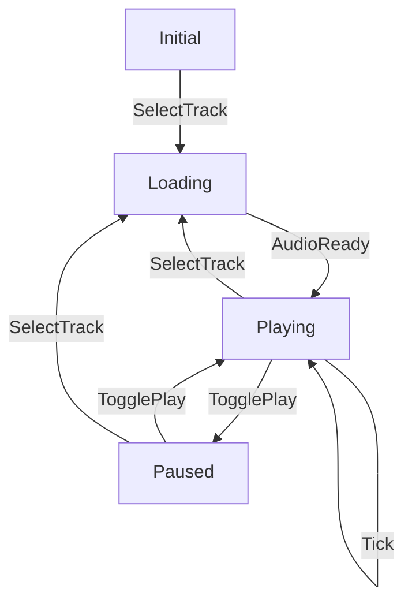

<Title>{{ $frontmatter.title }}</Title>

<Subtitle>
  bobkonf 2026
</Subtitle>

---
layout: mono-header
---

::header::

<Heading>Link to Slides</Heading>

::main::

  <QRCode
    value="https://haglobah.github.io/talks/functional-programming-in-typescript"
    :width="320"
    :height="320"
  />

---
layout: mono-header
---

::header::

<Heading>Links</Heading>

::main::

- [functional-programming-typescript | Github](https://github.com/haglobah/functional-programming-typescript/tree/tutorial)
- [Audio Player | SolidJS playground](https://playground.solidjs.com/anonymous/ca35d06f-0f0f-499f-a035-2b83804015b4)

---
layout: mono-header
---

::header::

<Heading>Overview</Heading>

::main::

<v-clicks>

0. Imperative, hidden-model audio player application.
1. Refactoring to: _Making Illegal States Unrepresentable_ + explicit model
2. Refactoring to: `reduce`-style state transitions
3. Refactoring to: Explicit side effects
4. Extensibility & Maintainability: Adding functionality
5. Outlook

</v-clicks>

---
layout: mono-header
---

::main::

<Title>Code, Part 0</Title>

---
layout: iframe

url: https://playground.solidjs.com/anonymous/ca35d06f-0f0f-499f-a035-2b83804015b4
---
---
layout: mono-header
---

::header::
<Heading>0. SolidJS Audio Player</Heading>

::main::

<v-clicks>

- The intent of the programmer is hidden; no explicit model in code
- State is managed with 4 independent variables (`isPlaying`, `isLoading`, `currentTrack`, `currentTime`) that shouldn't be independent according to our intent
- No pure function in the whole example

</v-clicks>

---
layout: mono-header
---

::main::

<Title>Code, Part 1</Title>

---
layout: iframe

url: https://playground.solidjs.com/anonymous/9cf89bcf-934b-4702-9457-302e02ad0e83
---
---
layout: mono-header
---

::header::
<Heading>1. Making Illegal States Unrepresentable</Heading>

::main::

<v-clicks>

- Hidden intent becomes explicit model
- Illegal states are unrepresentable now
- Minor TypeScript annoyances: Explicit type casting
- But still imperative state setting

</v-clicks>

---
layout: mono-header
---

::header::
<Heading>What We Want</Heading>

::main::

---
layout: mono-header
---

::main::

<Title>Code, Part 2</Title>

---
layout: iframe

url: https://playground.solidjs.com/anonymous/996c9776-a603-4913-a2a9-7c8fa67b380a
---
---
layout: mono-header
---

::header::
<Heading>2. Purely Functional State Transitions</Heading>

::main::

<v-clicks>

- `reduce` function: `(s: State, a: Action): State`
- `setState` calls become `dispatch` calls (that `dispatch` actions to the state)
- `createReducer`: Wrapper around a <OuterLink href="https://docs.solidjs.com/concepts/stores">solid store</OuterLink> with immutable update diffing (<OuterLink href="https://www.solidjs.com/tutorial/stores_immutable">`reconcile`</OuterLink>)
- `reduce` is a pure function -> _very_ easy to test
- Effects are still implicit

</v-clicks>

---
layout: mono-header
---

::main::

<Title>Code, Part 3</Title>

---
layout: iframe

url: https://playground.solidjs.com/anonymous/26c8f123-71c6-4777-89e0-d74a8a4b3793
---
---
layout: mono-header
---

::header::
<Heading>3. Modeling effects as data</Heading>

::main::

<v-clicks>

- Side effects to be executed become explicit: `Cmd`
- Effect interpreter uses `Cmd`s, and performs them: `execute`: `(c: Cmd) => void`
- `Action` becomes `Msg` (for disambiguation only)
- `reduce` becomes `update` (as in Elm): `(s: State, m: Msg) => [State, Cmd]`
- We need to call execute somewhere: In `createUpdater` (successor of `createReducer`)
- Added: Type construction helpers
- Code blew up: Is that worth it?

</v-clicks>

---
layout: mono-header
---

::header::
<Heading>4. Tasks</Heading>

::main::

<v-clicks>

1. Review one of the previous refactorings
2. Add a `Seek` functionality (for selecting any timestamp of a song) with an input slider
3. The `tracks` aren't currently in the state. Add them.
4. Explore the codebase: There's an imperative `SignInForm` and `SignUpForm` you could improve, and/or use the `Auth` model in the auth-related code.

</v-clicks>

---
layout: mono-header
---

::header::

<Heading>Improvements/Issues</Heading>

::main::

<v-clicks>

- TypeScript's tagged unions are pretty verbose
- The need to give type hints is annoying sometimes

</v-clicks>

---
layout: mono-header
---

::header::
<Heading>Outlook</Heading>

::main::

<v-clicks>

- Adding proper immutable data structures: [Immutable.js](https://immutable-js.com/)
- Adding Maybe, Either and such: [purify-ts](https://gigobyte.github.io/purify/getting-started)
- [Effect](https://effect.website/)

</v-clicks>

---
layout: mono-header
---

::header::
<Heading>Resources</Heading>

::main::

- <OuterLink href="https://functional-architecture.org/make_illegal_states_unrepresentable/">Making Illegal States Unrepresentable</OuterLink>
- <OuterLink href="https://lexi-lambda.github.io/blog/2019/11/05/parse-don-t-validate/">Parse, don't Validate</OuterLink>
- <OuterLink href="https://functional-architecture.org/functional_core_imperative_shell/">Functional Core, Imperative Shell</OuterLink>

---
src: ./parts/beat.md
---
