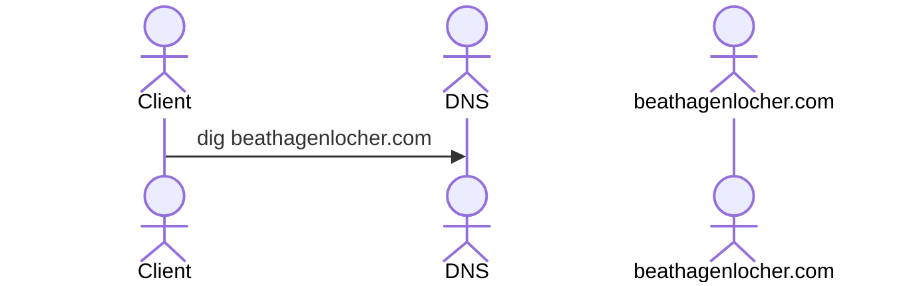
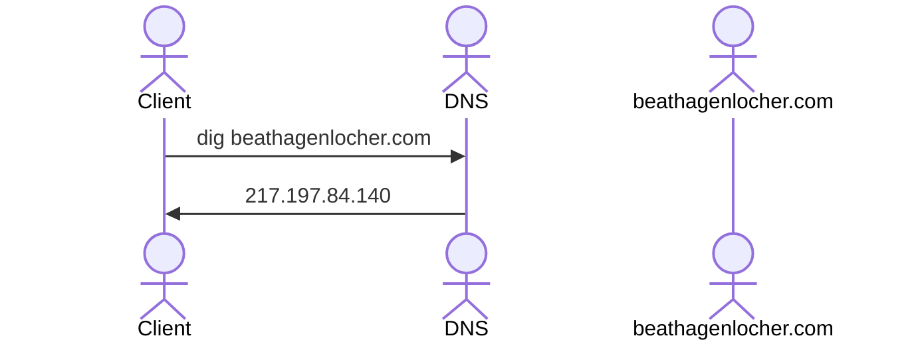
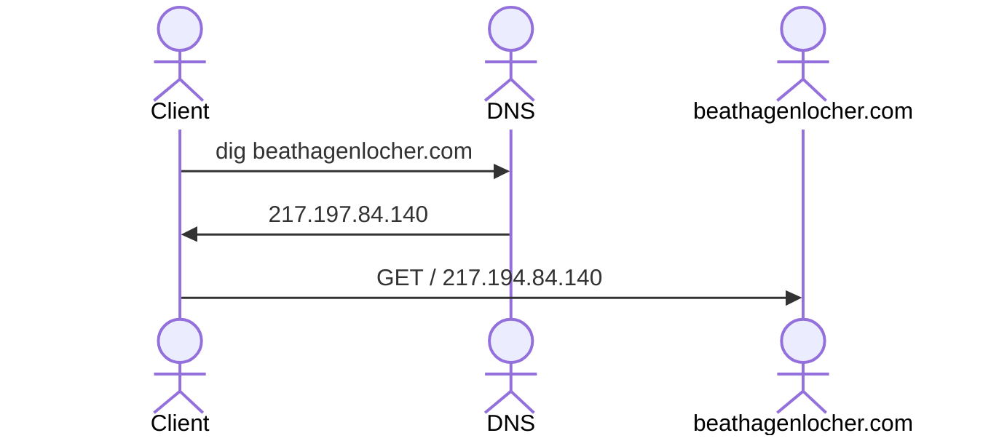
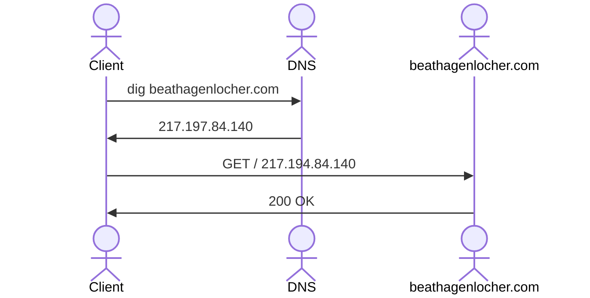

::header::
<Heading>Web: Accessing a Server</Heading>

::main::

<Transform :scale="2">

</Transform>

<Transform :scale="2">

</Transform>

<Transform :scale="2">

</Transform>

<Transform :scale="2">

</Transform>

